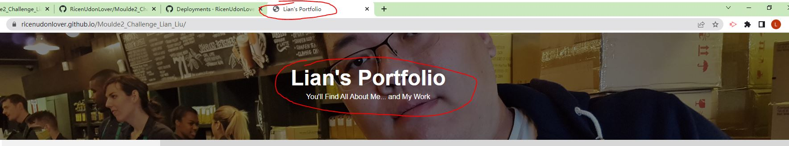
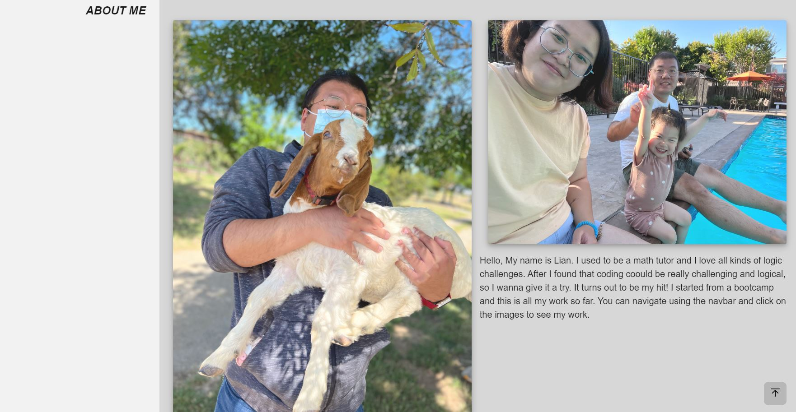

# Module 2 Challenge

## Objective:
* Create a student portfolio that contains the developer's name, a recent photo or avatar, and links to sections about them, their work, and how to contact them.
* There will be a navigation bar that brings the viewer to the corresponding section.
* There will be images for the developer's previous applications, the first one needs to be bigger than the others.
* There will be links on the images that take the viewer to the deployed application.
* There will be a responsive layout that adapts different screen sizes.

## The Outcome:
* A header was made so that it is easy to see what kind of webpage it is. The site title was renamed to show the content of the site.

 

 
 
 

* A floating navigation bar was made to take the viewer to the corresponding sections.

 

 
 
 

* A brief introduction to the developer is added to the first section.

 

 
 
 

* The developer's previous work were added to the second section. All the images will take the viewer to the deployed application.

 

 
 
 

* Links to the deployer's social media accounts were added so that the viewer can know more about the developer or contact him.

 

 
 
 

* A back to top button was added for fun :)

 

 
 
 

* Media query was added to produce a responsive layout.

 

 
 
 

## The objectives are accomplished! Yay! 

## Installation

The project was uploaded to a [github](https://github.com/) repository. You can get access from [here](https://github.com/RicenUdonLover/Moulde2_Challenge_Lian_Liu).
 
You can also see the deployed webpage [over here](https://ricenudonlover.github.io/Moulde2_Challenge_Lian_Liu/).
